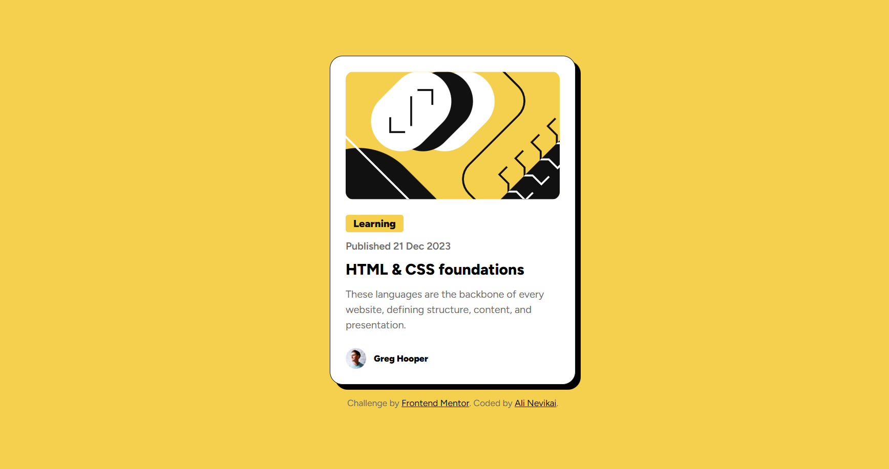
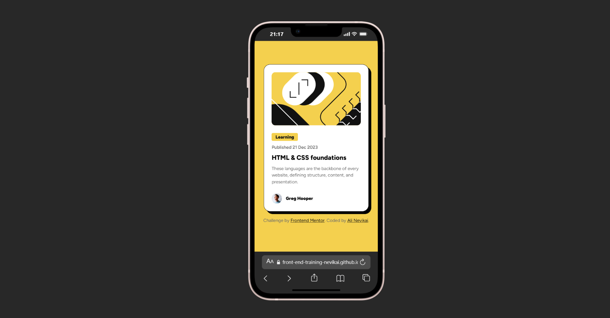

# Frontend Mentor - Blog preview card solution

This is a solution to the [Blog preview card challenge on Frontend Mentor](https://www.frontendmentor.io/challenges/blog-preview-card-ckPaj01IcS).
Frontend Mentor challenges help you improve your coding skills by building realistic projects.

---

## Table of contents

- [Overview](#overview)
  - [The challenge](#the-challenge)
  - [Screenshot](#screenshot)
  - [Links](#links)
- [My process](#my-process)
  - [Project structure](#project-structure)
  - [Built with](#built-with)
  - [What I learned](#what-i-learned)
  - [Continued development](#continued-development)
  - [Useful resources](#useful-resources)
- [Author](#author)
- [Acknowledgments](#acknowledgments)

---

## Overview

### The challenge

Users should be able to:

- View the optimal layout depending on their device's screen size
- See hover and focus states for all interactive elements on the page

This project focuses on building a clean, responsive card component using semantic HTML and a mobile-first CSS workflow.

---

### Screenshot
Desktop



Mobile



---

### Links

- Solution URL: [Solution](https://www.frontendmentor.io/solutions/solution-blog-preview-card-hvMVSjb2s6)
- Live Site URL: [Live Demo](https://front-end-training-nevikai.github.io/Blog-preview-card/)

---

## My process

### Project structure

The project follows a clean and scalable structure:
```text
/
├── index.html
├── README.md
├── .gitignore
└── assets
├── images
│ ├── favicon-32x32.png
│ ├── illustration-article.svg
│ └── image-avatar.webp
└── styles
├── main.css
├── root.css
├── reset.css
├── mobileFirst.css
├── desktop.css
└── footer.css
```

CSS files are modularized to separate concerns such as variables, reset rules, layout, responsiveness, and footer styling.

---

### Built with

- Semantic HTML5 markup
- CSS custom properties (variables)
- Flexbox
- Mobile-first workflow
- Modular CSS architecture
- Google Fonts (Figtree)

---

### What I learned

During this project, I reinforced several important front-end fundamentals:

- Structuring HTML using semantic elements for better accessibility and readability
- Organizing CSS into multiple files to improve maintainability
- Building layouts using a true mobile-first approach
- Creating a small design system using CSS custom properties for colors, spacing, and typography

Example of reusable CSS variables:

```css
:root {
  --color-yellow: #f4d04e;
  --txt-sm: 14px;
  --space-lg: 12px;
}
```
This approach makes the design easier to scale and adjust in future projects.

---

### Continued development
 In future projects, I would like to focus more on:

- Converting pixel-based values to `rem` units for better scalability

- Improving hover and focus states for enhanced accessibility

- Reducing the need for `!important` by improving CSS specificity strategies

---

### Useful resources


- Great platform for practicing real-world front-end challenges [Frontend Mentor](https://www.frontendmentor.io/)


- My go-to reference for HTML and CSS [MDN Web Docs](https://developer.mozilla.org/)

---

### Author

[Ali Nevikai](https://www.frontendmentor.io/profile/nevikai)

[GitHub](https://github.com/nevikai)

---
### Acknowledgments

Thanks to Frontend Mentor for providing well-designed challenges that help developers practice and improve real-world front-end skills.
